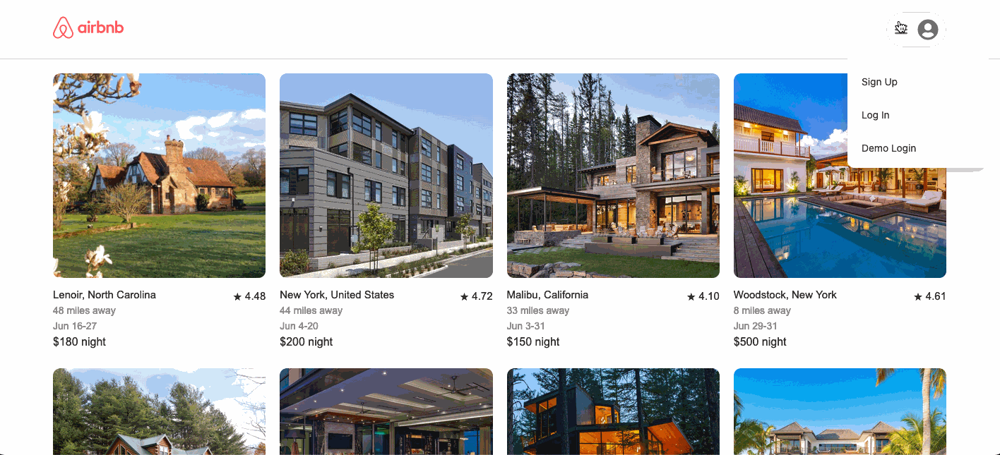
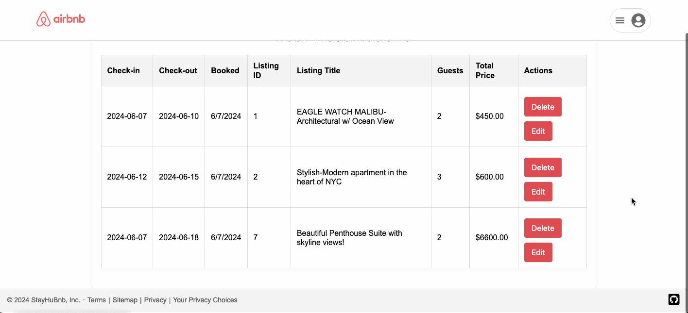

# WELCOME TO STAYHUBNB

Check out the [Live Site](https://stayhubnb.onrender.com/)!

### Introduction

StayHubNB is a clone of the Airbnb website at the time of creation. Airbnb is a platform that allows users to find and book accommodations worldwide, offering a wide range of lodging options from apartments to villas. With StayHuBnB, users can seamlessly browse available listings, view detailed information about each property, and make reservations. Inspired by my passion for travel and technology, I aimed to build a user-friendly platform that offers the core functionalities of Airbnb. The technologies implemented in this project include:

* Languages: Javascript, Ruby, HTML, and CSS
* Frontend: React-Redux
* Database: PostgreSQL
* Hosting: Render
* Asset Storage: AWS Simple Cloud Storage (S3)

StayHuBnB currently provides users with the ability to:

* User Auth
* Browse Listings
* View Listing Details
* Create Reservations
* Manage Reservations

# MVPs

## User Auth

In StayHuBnb is it neccessary to keep track of the reservations made, for that reason user authentication is implement with the functionality to sign up or log in:



```
  return (
    <>
      {/* <h1>Log In</h1> */}
      <form onSubmit={handleSubmit}>
        <ul>
          {errors.map((error, idx) => <li key={idx}>{error}</li>)}
        </ul>
        <label>
          Email
          <input
            type="text"
            value={email}
            onChange={(e) => setEmail(e.target.value)}
            required
          />
        </label>
        <label>
          Password
          <input
            type="password"
            value={password}
            onChange={(e) => setPassword(e.target.value)}
            required
          />
        </label>
        <button type="submit">Log In</button>
      </form>
    </>
  );
```
```
return (
    <>
      {/* <h1>Sign Up</h1> */}
      <form onSubmit={handleSubmit}>
        <ul>
          {errors.map((error, idx) => <li key={idx}>{error}</li>)}
        </ul>
        <label>
          Full Name
          <input
            type="text"
            value={fullName}
            onChange={(e) => setFullName(e.target.value)}
            required
          />
        </label>
        <label>
          Email
          <input
            type="email"
            value={email}
            onChange={(e) => setEmail(e.target.value)}
            required
          />
        </label>
        <label>
          Password
          <input
            type="password"
            value={password}
            onChange={(e) => setPassword(e.target.value)}
            required
          />
        </label>
        <label>
          Confirm Password
          <input
            type="password"
            value={confirmPassword}
            onChange={(e) => setConfirmPassword(e.target.value)}
            required
          />
        </label>
        <button type="submit">Sign Up</button>
      </form>
    </>
  );
```

The user interface is simplified so that log in and sign up can be easy to access through a modal:


```
    return (
    <>
      <div className='overlay' onClick={handleOverlayClick}></div>
      <Modal onClose={onClose}>
        <div className="session-modal">
          <div id='line'>
            <button id="close-button" onClick={onClose}>
              &times;
            </button>
            <h2>{modalType === 'login' ? 'Log In ' : 'SignUp'}</h2>
          </div>
          {modalType === 'login' ? <LoginForm /> : <SignupForm />}
          <button
            className="link"
            onClick={() =>
              dispatch(showModal(modalType === 'login' ? 'signup' : 'login'))
            }
          >
            {modalType === 'login' ? 'Sign up' : 'Log in'} instead
          </button>
        </div>
      </Modal>
    </>
  );
```

## Browse/View listings

A user is welcomed by the homepage, which lists all the available listings. Whether logged in or not, the user can freely browse through all the listings:


```
return (
        <div className="listings-container">
            <ul className="listings-grid">
                {listings.map((listing) => (
                    <li key={listing.id} className="listing-card">
                        <Link to={`/${listing.id}`} className="listing-link">
                        
                        <div className="listing-info">
                            <p className="listing-title">{listing.address}</p> 
                            <p className="listing-miles">{generateRandomMiles()} miles away</p>
                            <p className="listing-date">{generateRandomDateRange()}</p> 
                            <p className="listing-rating">&#9733; {generateRandomRating().toFixed(2)}</p>
                            {/* <p className="listing-price">$<span className="price-value">{listing.price/10}</span> night</p> */}
                            <p className="listing-price">
                                    <span className="price-value">${listing.price/1}</span> 
                                    <span className="per-night"> night</span>
                            </p>
                        </div>
                        </Link>
                    </li>
                ))}
            </ul>
        </div>
    )
```

After clicking on a specific listing, the user is directed to its show page, where they can see all the detailed information about the listing and have the option to make a booking:


```
return (
    <div className="listing-show">
      <div className="listing-header">
        <h1>{listing.title}</h1>
      </div>
      <div className='image-grid'>
      
        {listing.photos.slice(1).map((photo, index) => (
            
        ))}
      </div>
      <div className="split-container">
        <div className='split left'>
          <div className="listing-owner">
            <p className="listing-location">Entire house in {listing.address}</p>
            <p className='info-tg'>Studio · 4 beds · 2 bath</p>
            <p id='rating'>&#9733; {generateRandomRating().toFixed(2)}</p>
            <div className='divider'></div>
            <div className="listing-host">
              
              <div className='flex'>
              <span className="host-name">Hosted by {listing.host.fullName}</span>
              <p id='rat'>Superhost · 2 years hosting</p>
              </div>
            </div>
            <div className='divider'></div>
          </div>
          <div className="listing-details">
            <h2>About this space</h2>
            <p>{listing.description}</p>
            <div className='divider'></div>
            <h3>What this place offers</h3>
            <div className="amenities">
              {listing.amenities.split(',').map((amenity, index) => (
                <div className="amenity" key={index}>
                  {amenity == 'WiFi' ? <><FaWifi /><span className="amenity-text">WiFi</span></> : null}
                  {amenity == 'Pool' ? <><MdOutlinePool/> <span className="amenity-text">Pool</span></> : null}
                  {amenity == 'Air Conditioning' ? <><IoSnow/> <span className="amenity-text">A/C</span></> : null}
                  {amenity == 'Parking' ? <><IoCarOutline/> <span className="amenity-text">Parking</span></> : null}
                  {amenity == 'Kitchen' ? <><TbToolsKitchen2/><span className="amenity-text">Kitchen</span></> : null}
                  {amenity == 'Bathub' ? <><PiBathtub/> <span className="amenity-text">Bathtub</span></> : null}
                </div>
              ))}
            </div>
            <div className='divider'></div>
          </div>
        </div>
        <div className='split right'>
          <div className="pricing-reservation">
            <div className="pricing">${listing.price/1} night</div>
            <form className="reservation-form" onSubmit={handleReserve}>
              <div className='res-grid'>
              <div className='lbl-box'>
              <label>
                Check-in:
                <DatePicker 
                  selected={startDate} 
                  onChange={(date) => setStartDate(date)} 
                  selectsStart 
                  startDate={startDate} 
                  endDate={endDate} 
                  minDate={new Date()}
                />
              </label>
              </div>
              <div className='lbl-box '>
              <label>
              Check-out:
                <DatePicker 
                  selected={endDate} 
                  onChange={(date) => setEndDate(date)} 
                  selectsEnd 
                  startDate={startDate} 
                  endDate={endDate} 
                  minDate={startDate}
                />
              </label>
              </div>
              <div className='lbl-box guest-col guest-row'>
              <label>
              Guests:
                <input 
                  type="number" 
                  value={guest} 
                  min="1" 
                  onChange={(e) => setGuest(parseInt(e.target.value, 10))} 
                />
              </label>
              </div>
              </div>
              <div className="total-price">
                Total: ${calculateTotalPrice()/1}
              </div>
              <button className="reserve-button" type="submit">
                Reserve
              </button>
            </form>
          </div>
        </div>
      </div>
      <div className="reviews">
        <h2>Reviews</h2>
        {dummyReviews.map(review => (
          <div className="review" key={review.id}>
            
            <div className="review-content">
              <span className="review-author">{review.author.name}</span>
              <p className="review-text">{review.text}</p>
            </div>
          </div>
        ))}
      </div>
    </div>
  );
```

## Reservation (CRUD)

In StayHuBnB, a logged-in user can make a reservation on the desired listing and is then directed to the reservations index page, where all their reservations are shown. Once the user is at the index page, a table will be shown with all the reservations details and will have options to edit or delete a reservation:


```
  return (
    <div className="reservation-index">
      <h1>Your Reservations</h1>
      <table>
        <thead>
          <tr>
            <th>Check-in</th>
            <th>Check-out</th>
            <th>Booked</th>
            <th>Listing ID</th>
            <th>Listing Title</th>
            <th>Guests</th>
            <th>Total Price</th>
            <th>Actions</th>
          </tr>
        </thead>
        <tbody>
          {reservations.map(reservation => (
            new Date(reservation.createdAt).toString() !== "Invalid Date" &&
            <tr key={reservation.id}>
              <td>{(reservation.startDate)}</td>
              <td>{reservation.endDate}</td>
              <td>{new Date(reservation.createdAt).toLocaleDateString()}</td>
              <td>{reservation.listingId}</td>
              <td>{reservation.title}</td>
              <td>{reservation.guest}</td>
              <td>${calculateTotalPrice(reservation.startDate, reservation.endDate, reservation.price).toFixed(2)}</td>
              <td>
                <button className="delete-button" onClick={() => handleDelete(reservation.id)}>Delete</button>
                <Link to={`/reservations/${reservation.id}/edit`}><button className="edit-button">Edit</button></Link>
              </td>
            </tr>
          ))}
        </tbody>
      </table>
    </div>
  );
```

The Edit page to update a reservation:



```
return (
    <div className="reservation-edit-container">
      <h1>Edit Reservation</h1>
      <div className="form-group">
        <label htmlFor="startDate">Check-in</label>
        <input
          type="date"
          id="startDate"
          value={startDate}
          onChange={(e) => setStartDate(e.target.value)}
        />
      </div>
      <div className="form-group">
        <label htmlFor="endDate">Check-out</label>
        <input
          type="date"
          id="endDate"
          value={endDate}
          onChange={(e) => setEndDate(e.target.value)}
        />
      </div>
      <div className="form-group">
        <label htmlFor="guest">Guests</label>
        <input
          type="number"
          id="guest"
          value={guest}
          min="1"
          onChange={(e) => setGuest(parseInt(e.target.value, 10))}
        />
      </div>
      <button className="update-button" onClick={handleUpdate}>Update</button>
    </div>
  );
```

### Thanks

StayHuBnb was created within a 14 day time frame. Thank you for your time and consideration! I hope you enjoy it!
